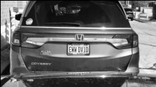

# detectr
Simple license plate detection program which uses image processing techniques written from scratch in Python. Techniques based on course content from COMPSCI 373.

## Intro
The aim of this project was to utilize image processing techniques such as contrast stretching, thresholding, and various image morphology processes.

The program takes in a picture of a license plate like so:

And outputs the same image with a bounding box around the license plate:

## How it works

### **Step 1:** Conversion to greyscale
The first step is to convert the input image to greyscale. Reason being is in our context of license plate detection here, the colour information of the image is irrelevant.

### **Step 2:** Contrast stretching
After converting our image to greyscale, we want to **contrast stretch** the image. **Contrast stretching** is a simple process of improving the contrast within an image by stretching the range of intensity values in the image. In our case, the range is 0 - 255.

### **Step 3:** Standard deviation filtering
Next, we apply a standard deviation filter which for each pixel, takes in the values in the 5x5 neighbourhood for some pixel `(x, y)` and assigns the value at `(x, y)` to whatever the standard deviation is in the neighbourhood. Note that a contrast stretching is also done again after this step.

### **Step 4:** Binary thresholding
To achieve segmentation, we apply thresholding to the image. Any pixel with an intensity of < 150 is set to 0, while any pixel with an intensity of >= 150 is set to 255

### **Step 5:** Binary closing
To achieve the license plate "blob", we want to do a *binary close*. A binary close is carried out by dilating the image, which adds pixels to the boundaries of objects. Then, we erode the image which shrinks the foreground objects.

### **Step 6:** Connected component analysis
We want to generate an `n x m` array `g` where `g[y][x] = l` denotes that the pixel `(x, y)` in image `i` belongs to the connected component given label `l`. To do this, we just perform a **breadth-first search** (BFS).

### **Step 7:** Bounding box retrieval
For the last step, we sort the labels in descending order from the previous step based on the number of pixels that belong to that connected component. Then for each label, we calculate the min/max x/y coordinates and check if the aspect ratio `r` is `1.5 <= r <= 5`. If the aspect ratio is within bounds, then we have the values for the license plate and we can draw the bounding box!

